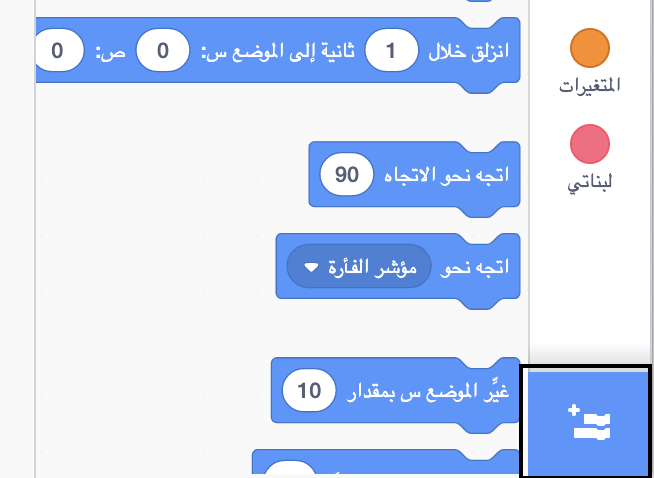
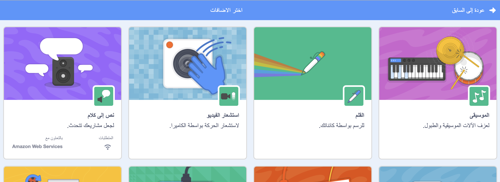
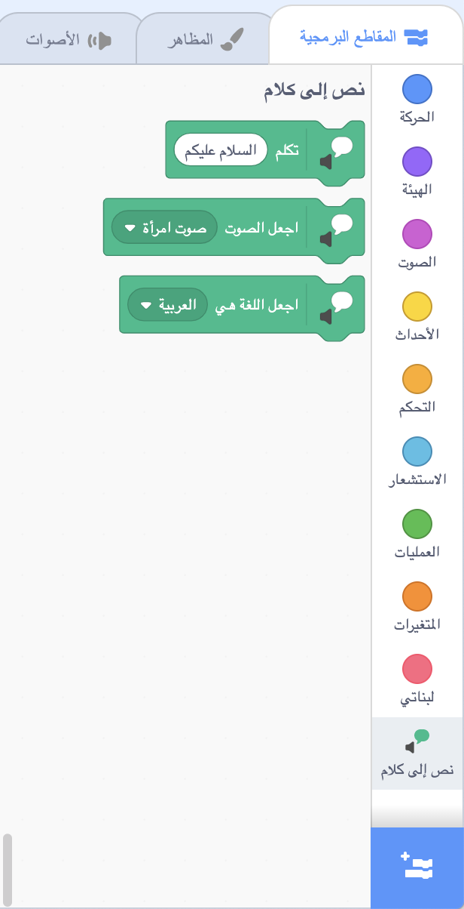

** حديث بيكو وجيجا مع ملحق الكلام**: [انظر في الداخل](https://scratch.mit.edu/projects/499373708/editor){:target="_blank"}

<div class="scratch-preview">
  <iframe allowtransparency="true" width="485" height="402" src="https://scratch.mit.edu/projects/embed/499373708/?autostart=false" frameborder="0"></iframe>
</div>

انقر على **ادراج اضافة**:



Choose **Text to Speech**:



You will get a new `Text to Speech`{:class="block3extensions"} blocks menu:



يمكنك استخدام الكتل الموجودة في قائمة الكتل `نص الى كلام`{:class="block3extensions"} لجعل الكائنات تتحدث بصوت عالٍ.

You can make a sprite talk out loud when clicked:

```blocks3
when this sprite clicked
set voice to (alto v) :: tts
set language to (Spanish v) :: tts
speak [Hola] :: tts
```

You can even give your sprite a kitten voice!

```blocks3
set voice to (kitten v) :: tts
speak [Cat gotta haz milk.] :: tts
```
