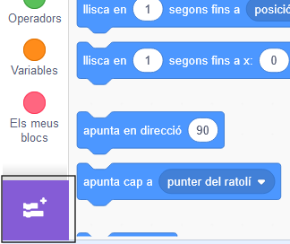
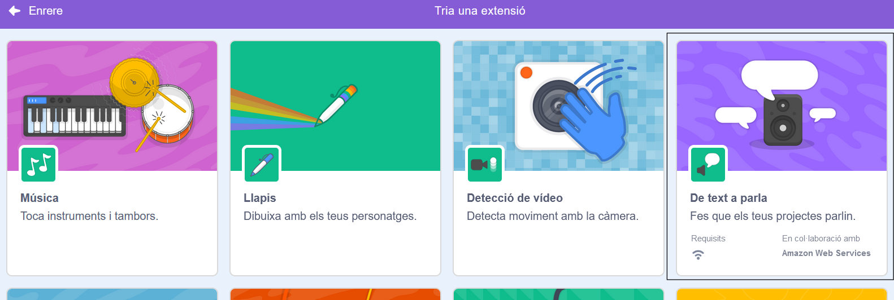
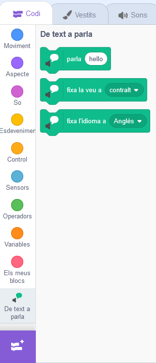

En **Pico i Giga parlen amb l'extensió de veu**: [Veure dins](https://scratch.mit.edu/projects/499373708/editor){:target="_blank"}

<div class="scratch-preview">
  <iframe allowtransparency="true" width="485" height="402" src="https://scratch.mit.edu/projects/embed/499373708/?autostart=false" frameborder="0"></iframe>
</div>

Feu clic a **Afegeix una extensió**:



Trieu **Text a parla**:



Obtindreu un nou menú de blocs `Text a parla`{:class="block3extensions"}:



Podeu utilitzar els blocs del menú de blocs `Text a parla`{:class="block3extensions"} per fer que els vostres personatges parlin en veu alta.

Podeu fer que un personatge parli en veu alta quan feu clic:

```blocks3
when this sprite clicked
set voice to (alto v) :: tts
set language to (Spanish v) :: tts
speak [Hola] :: tts
```

Fins i tot pots donar una veu de gatet al teu personatge!

```blocks3
set voice to (kitten v) :: tts
speak [Cat gotta haz milk.] :: tts
```
