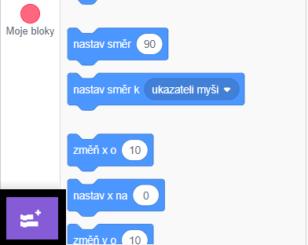
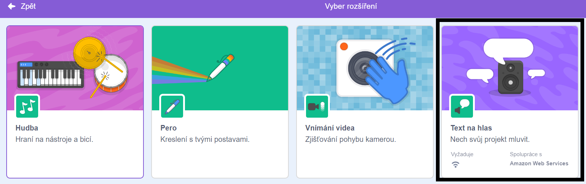
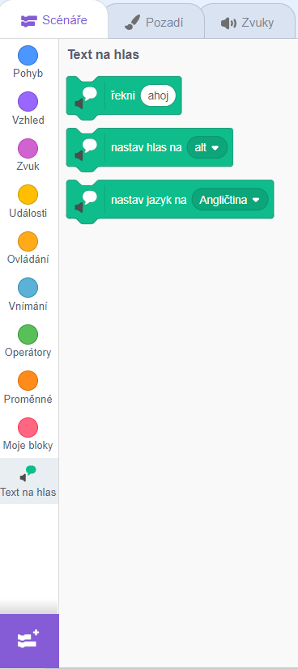

**Pico a Giga mluví s rozšířením řeči**: [See inside](https://scratch.mit.edu/projects/499373708/editor){:target="_blank"}

<div class="scratch-preview">
  <iframe allowtransparency="true" width="485" height="402" src="https://scratch.mit.edu/projects/embed/499373708/?autostart=false" frameborder="0"></iframe>
</div>

Klikni na **Přidej rošíření**:



Vyberte **Text na hlas**:



Získáte nový `Hlas na text`{:class="block3extensions"} nabídku bloků:



Můžete použít bloky v `Text na hlas`{:class="block3extensions"} nabídce bloků, aby vaše postavy mluvila nahlas.

Postava může mluvt na hlas, když kliknete:

```blocks3
when this sprite clicked
set voice to (alto v) :: tts
set language to (Spanish v) :: tts
speak [Hola] :: tts
```

Můžete postavě dát i hlas koťátka!

```blocks3
set voice to (kitten v) :: tts
speak [Kočka potřebuje mléko.] :: tts
```
