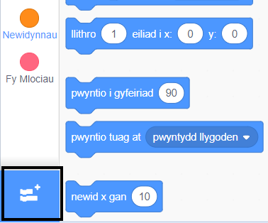
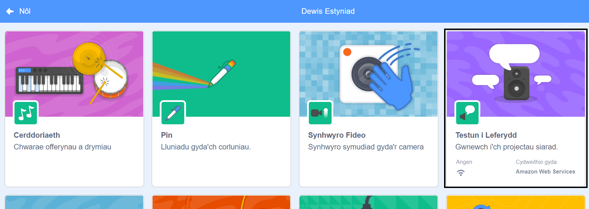
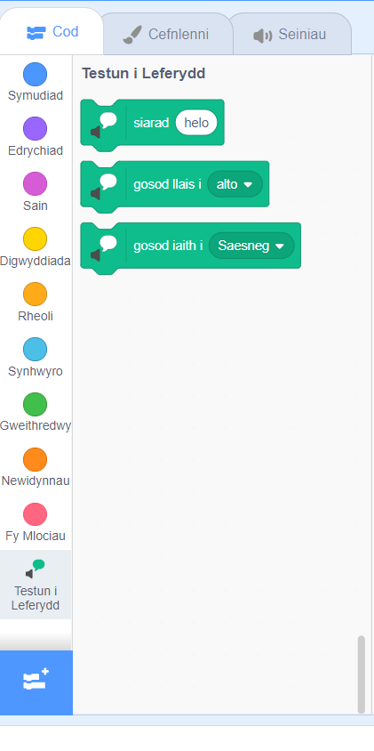

**Pico a Giga yn siarad gyda'r estyniad lleferydd**: [Gweler y tu fewn i](https://scratch.mit.edu/projects/499373708/editor){:target="_blank"}

<div class="scratch-preview">
  <iframe allowtransparency="true" width="485" height="402" src="https://scratch.mit.edu/projects/embed/499373708/?autostart=false" frameborder="0"></iframe>
</div>

Cliciwch ar **Ychwanegu Estyniad**:



Dewiswch **Testun i Leferydd**:



Byddwch yn cael dewislen blociau `Testun i Leferydd`{:class="block3extensions"} newydd:



Gallwch ddefnyddio'r blociau yn y dewislen blociau `Testun i Leferydd`{:class="block3extensions"} i wneud i'ch corluniau i siarad yn uchel.

Gallwch chi wneud i gorlun siarad yn uchel pan fyddwch chi'n ei glicio:

```blocks3
when this sprite clicked
set voice to (alto v) :: tts
set language to (Welsh v) :: tts
speak [Helo] :: tts
```

Gallwch chi hyd yn oed roi llais cath fach i'ch corlun!

```blocks3
set voice to (kitten v) :: tts
speak [Angen llaeth ar y gath.] :: tts
```
