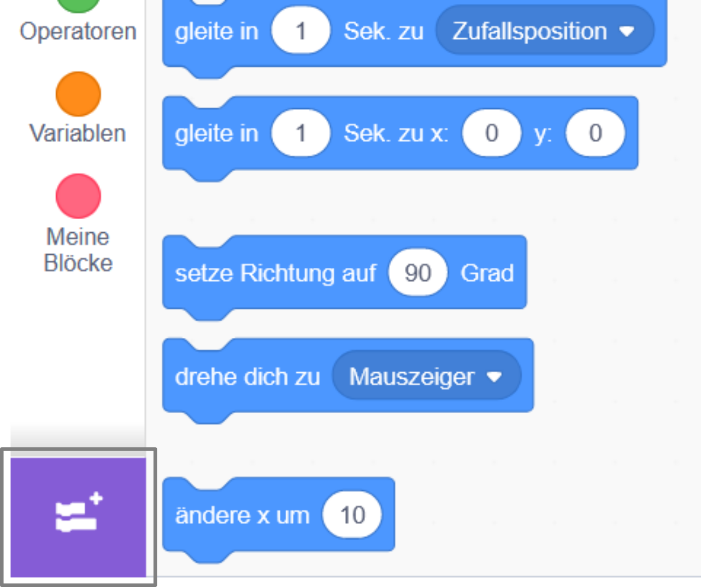
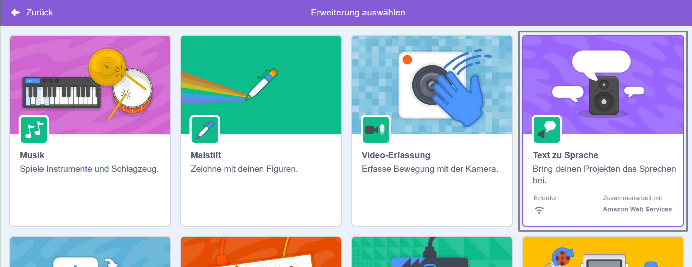
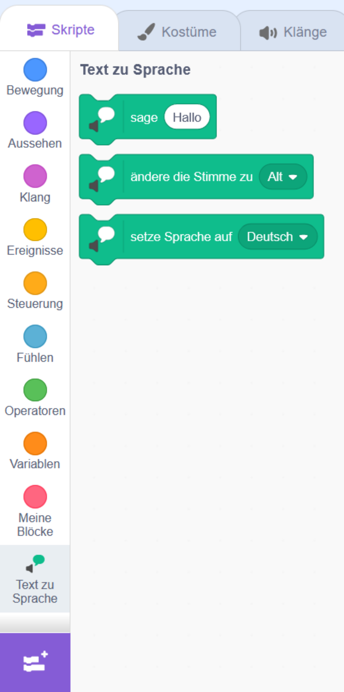

**Pico und Giga sprechen mit der Spracherweiterung**: [Schau es dir an](https://scratch.mit.edu/projects/499373708/editor){:target="_blank"}

<div class="scratch-preview">
  <iframe allowtransparency="true" width="485" height="402" src="https://scratch.mit.edu/projects/embed/499373708/?autostart=false" frameborder="0"></iframe>
</div>

Klicke auf **Erweiterung hinzufügen**:



Wähle **Text zu Sprache**:



Du bekommst ein neues `Text zu Sprache`{:class="block3extensions"} Blockmenü angezeigt:



Du kannst die Blöcke im Menü `Text zu Sprache`{:class="block3extensions"} verwenden, um deine Figuren laut sprechen zu lassen.

Du kannst eine Figur laut sprechen lassen, wenn du sie anklickst:

```blocks3
when this sprite clicked
set voice to (alto v) :: tts
set language to (Spanish v) :: tts
speak [Hola] :: tts
```

Du kannst deiner Figur sogar eine Kätzchenstimme geben!

```blocks3
set voice to (kitten v) :: tts
speak [Cat gotta haz milk.] :: tts
```
