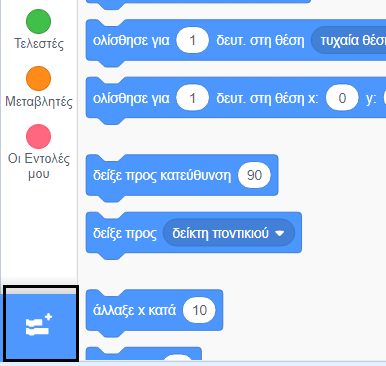
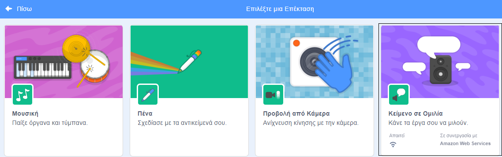
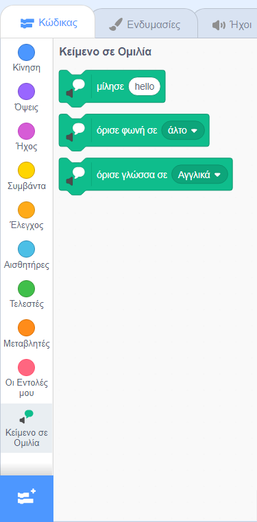

**Ο Pico και ο Giga μιλάνε με την επέκταση ομιλίας**: [Δες μέσα](https://scratch.mit.edu/projects/563550822/editor){:target="_blank"}

<div class="scratch-preview">
  <iframe allowtransparency="true" width="485" height="402" src="https://scratch.mit.edu/projects/embed/563550822/?autostart=false" frameborder="0"></iframe>
</div>

Κάνε κλικ στην **Προσθήκη Επέκτασης**:



Επίλεξε **Κείμενο σε ομιλία**:



Θα εμφανιστεί ένα μενού μπλοκ `Κείμενο σε Ομιλία`{:class="block3extensions"}:



Μπορείς να χρησιμοποιήσεις τα μπλοκ στο μενού μπλοκ `Κείμενο σε Ομιλία`{:class="block3extensions"} για να κάνεις τα αντικείμενά σου να μιλούν δυνατά.

Μπορείς να κάνεις ένα αντικείμενο να μιλήσει δυνατά όταν γίνει κλικ σε αυτό:

```blocks3
when this sprite clicked
set voice to (alto v) :: tts
set language to (Spanish v) :: tts
speak [Hola] :: tts
```

Μπορείς επίσης να δώσεις στο αντικείμενό σου μία φωνή μικρής γάτας!

```blocks3
set voice to (kitten v) :: tts
speak [Η γάτα πρέπει να έχει γάλα.] :: tts
```
