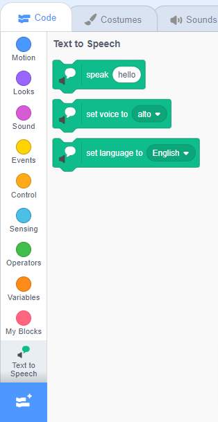

**Pico and Giga talk with the speech extension**: [See inside](https://scratch.mit.edu/projects/499373708/editor){:target="_blank"}

<div class="scratch-preview">
  <iframe allowtransparency="true" width="485" height="402" src="https://scratch.mit.edu/projects/embed/499373708/?autostart=false" frameborder="0"></iframe>
</div>

Click on **Add Extension**:


Choose **Text to Speech**:


You will get a new `Text to Speech`{:class="block3extensions"} blocks menu:



You can use the blocks in the `Text to Speech`{:class="block3extensions"} blocks menu to make your sprites talk out loud.

You can make a sprite talk out loud when clicked:

```blocks3
when this sprite clicked
set voice to (alto v) :: tts
set language to (Spanish v) :: tts
speak [Hola] :: tts
```

You can even give your sprite a kitten voice!

```blocks3
set voice to (kitten v) :: tts
speak [Cat gotta haz milk.] :: tts
```
