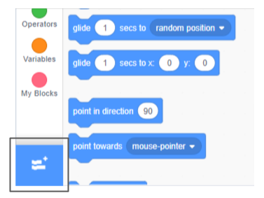
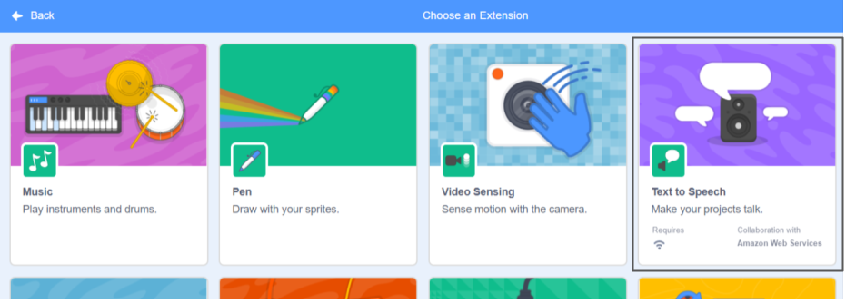

**Pico y Giga hablan con la extensión de voz**: [Ver el interior](https://scratch.mit.edu/projects/499373708/editor){:target="_blank"}

<div class="scratch-preview">
  <iframe allowtransparency="true" width="485" height="402" src="https://scratch.mit.edu/projects/embed/499373708/?autostart=false" frameborder="0"></iframe>
</div>

Haga clic en **Agregar extensión**:



Elija **Texto a voz**:



Obtendrá un nuevo menú `bloques de Texto a voz`{:class="block3extensions"}:


Puedes usar los bloques en el menú de bloques `Texto a voz`{:class="block3extensions"} para hacer que tus sprites hablen en voz alta.

Puedes hacer que un objeto hable en voz alta al hacer clic en:

```blocks3
when this sprite clicked
set voice to (alto v) :: tts
set language to (Spanish v) :: tts
speak [Hola] :: tts
```

¡Incluso puedes darle a tu duende una voz de gatito!

```blocks3
set voice to (kitten v) :: tts
speak [Cat gotta haz milk.] :: tts
```
