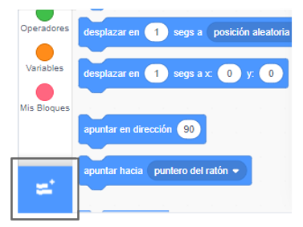
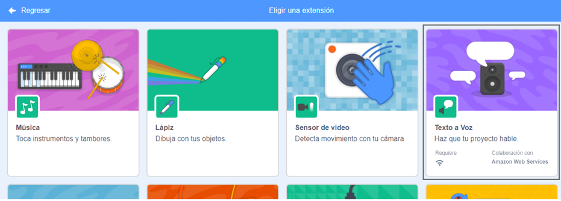
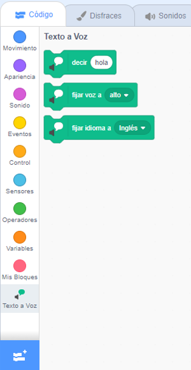

**Pico y Giga hablan con la extensión de voz**: [Ver dentro](https://scratch.mit.edu/projects/499373708/editor){:target="_blank"}

<div class="scratch-preview">
  <iframe allowtransparency="true" width="485" height="402" src="https://scratch.mit.edu/projects/embed/499373708/?autostart=false" frameborder="0"></iframe>
</div>

Haz clic en **Agregar Extensión**:



Elige **Texto a Voz**:



Obtendrás un nuevo menú de bloques `Texto a Voz`{:class="block3extensions"}:



Puedes usar los bloques en el menú `Texto a Voz`{:class="block3extensions"} para hacer que tus objetos hablen en voz alta.

Puedes hacer que un objeto hable en voz alta cuando se haga clic en él:

```blocks3
when this sprite clicked
set voice to (alto v) :: tts
set language to (Spanish v) :: tts
speak [Hola] :: tts
```

¡Incluso puedes darle a tu objeto una voz de gatito!

```blocks3
set voice to (kitten v) :: tts
speak [Cat gotta haz milk.] :: tts
```
