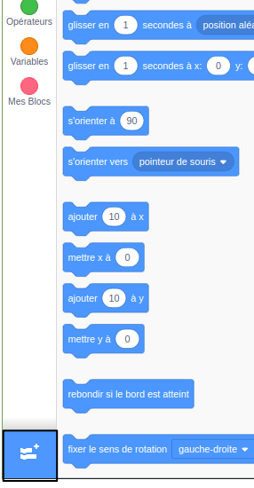
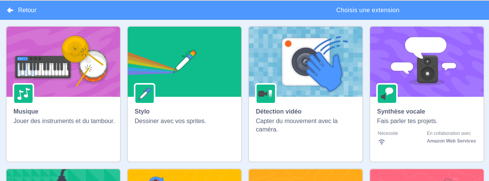
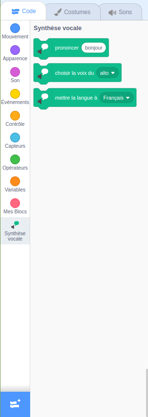

**Pico et Giga parlent avec l'extension Synthèse vocale** : [Voir à l'intérieur](https://scratch.mit.edu/projects/499373708/editor){:target="_ blank"}

<div class="scratch-preview">
  <iframe allowtransparency="true" width="485" height="402" src="https://scratch.mit.edu/projects/embed/499373708/?autostart=false" frameborder="0"></iframe>
</div>

Clique sur **Ajouter une extension** :



Choisis **Synthèse vocale**.



Tu obtiendras un nouveau menu bloc `Synthèse vocale`{:class="block3extensions"} :



Tu peux utiliser les blocs du menu bloc `Synthèse vocale`{:class="block3extensions"} pour faire parler tes sprites à voix haute.

Fais parler un sprite :

```blocks3
quand ce sprite est cliqué
choisir la voix du (alto v) :: tts
mettre la langue à (français v) :: tts
prononcer [Bonjour] :: tts
```

Tu peux même utiliser une voix de chaton !

```blocks3
choisir la voix du (chaton v) :: tts
prononcer [Le chat doit avoir du lait.] :: tts
```
