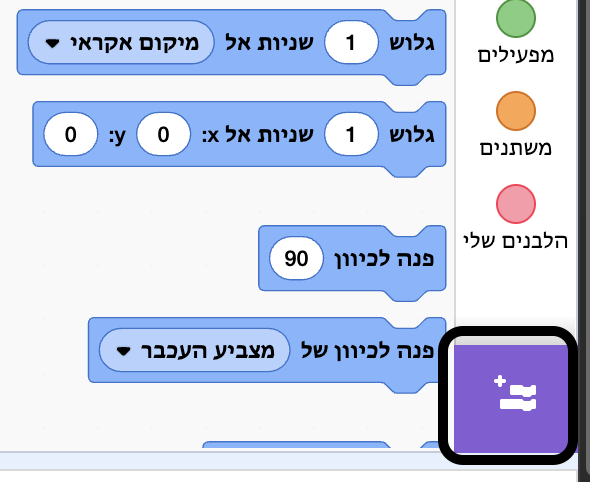
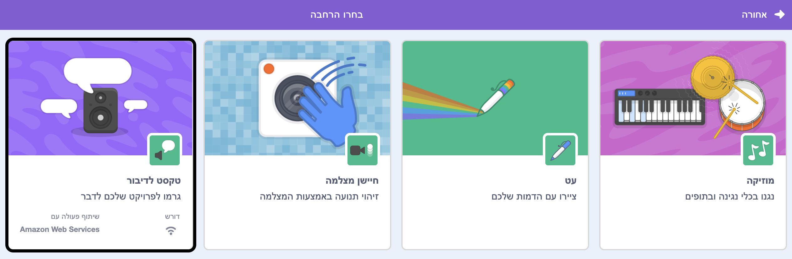
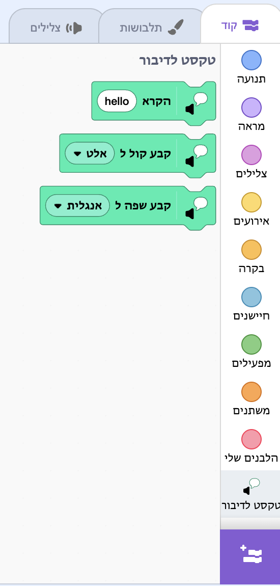

**פיקו וגיגה מדברים עם סיומת הדיבור**: [ראה בפנים](https://scratch.mit.edu/projects/499373708/editor){:target="_blank"}

<div class="scratch-preview">
  <iframe allowtransparency="true" width="485" height="402" src="https://scratch.mit.edu/projects/embed/499373708/?autostart=false" frameborder="0"></iframe>
</div>

לחץ על **להוספת הרחבה**:



בחר **טקסט לדיבור**:



יתקבל תפריט בלוקים חדש `טקסט לדיבור`{:class="block3extensions"}:



אתם יכולים להשתמש בבלוקים בתפריט `טקסט לדיבור`{:class="block3extensions"} בלוקים כדי לגרום לספרייט שלכם לדבר בקול רם.

אתם יכולים לגרום לספרייט לדבר בקול רם כשלוחצים עליו:

```blocks3
when this sprite clicked
set voice to (alto v) :: tts
set language to (Spanish v) :: tts
speak [Hola] :: tts
```

אתם אפילו יכולים לתת לספרייט שלכם קול של חתלתול!

```blocks3
set voice to (kitten v) :: tts
speak [Cat gotta haz milk.] :: tts
```
