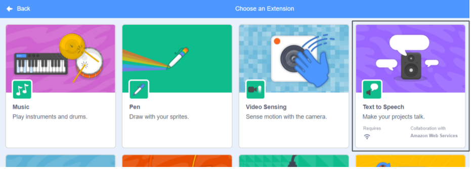

**पिको और गीगा स्पीच एक्सटेंशन के साथ बात करते हैं**: [अंदर देखें](https://scratch.mit.edu/projects/499373708/editor){:target="_blank"}

<div class="scratch-preview">
  <iframe allowtransparency="true" width="485" height="402" src="https://scratch.mit.edu/projects/embed/499373708/?autostart=false" frameborder="0"></iframe>
</div>

**जोड़ें एक्सटेंशन** पर क्लिक करें:


**टेक्स्ट टू स्पीच चुनें**:



आपको एक नया `टेक्स्ट टू स्पीच`{:class="block3extensions"} ब्लॉक मेन्यू मिलेगा:


आप अपने स्प्राइट्स को ज़ोर से बोलने के लिए `टेक्स्ट टू स्पीच`{:class="block3extensions"} ब्लॉक मेनू में ब्लॉक का उपयोग कर सकते हैं।

क्लिक करने पर आप स्प्राइट को ज़ोर से बोल सकते हैं:

```blocks3
when this sprite clicked
set voice to (alto v) :: tts
set language to (Spanish v) :: tts
speak [Hola] :: tts
```

आप अपने स्प्राइट को बिल्ली के बच्चे की आवाज भी दे सकते हैं!

```blocks3
set voice to (kitten v) :: tts
speak [Cat gotta haz milk.] :: tts
```
