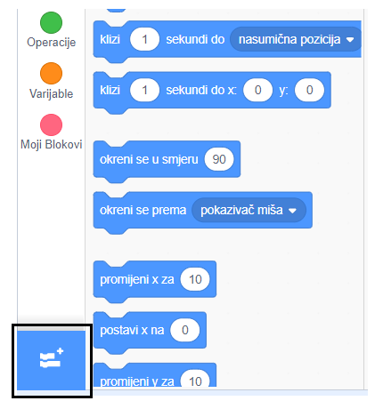
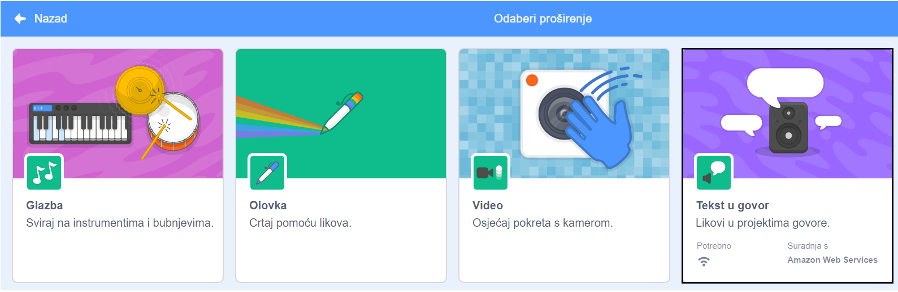
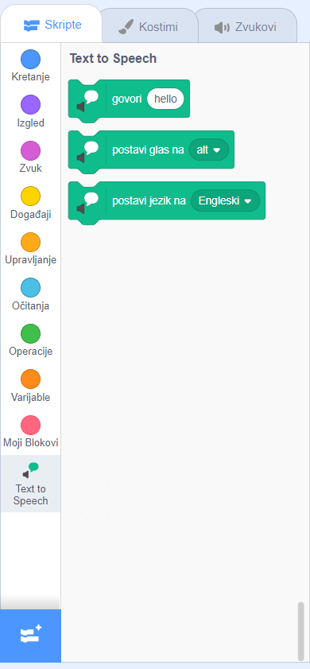

**Pico i Giga razgovaraju pomoću govornog proširenja**: [Pogledaj unutra](https://scratch.mit.edu/projects/823137952/editor){:target="_blank"}

<div class="scratch-preview">
  <iframe allowtransparency="true" width="485" height="402" src="https://scratch.mit.edu/projects/embed/823137952/?autostart=false" frameborder="0"></iframe>
</div>

Klikni na **Dodaj proširenje**:



Odaberi **Tekst u govor**:



Dobiti ćeš novi izbornik blokova `Tekst u govor`{:class="block3extensions"}:



Možeš upotrijebiti blokove u izborniku blokova `Tekst u govor`{:class="block3extensions"} kako bi tvoji likovi govorili naglas.

Možeš učiniti da lik govori naglas kada klikneš na njega:

```blocks3
when this sprite clicked
set voice to (alto v) :: tts
set language to (Croatian v) :: tts
speak [bok] :: tts
```

Možeš čak dati svom liku glas mačića!

```blocks3
set voice to (kitten v) :: tts
speak [Mačka treba mlijeko.] :: tts
```
