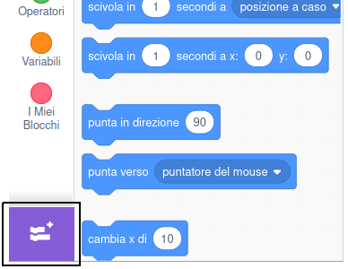
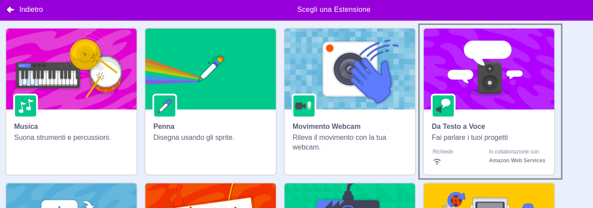
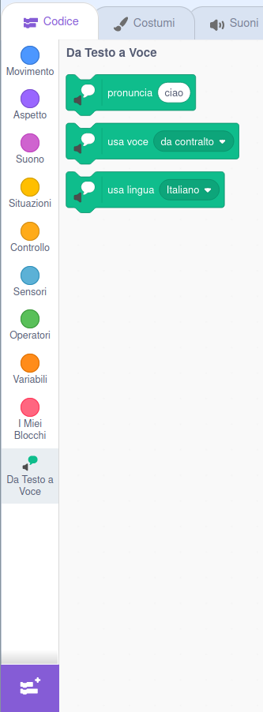

**Pico e Giga parlano con l'estensione vocale**: [Guarda dentro](https://scratch.mit.edu/projects/499373708/editor){:target="_blank"}

<div class="scratch-preview">
  <iframe allowtransparency="true" width="485" height="402" src="https://scratch.mit.edu/projects/embed/499373708/?autostart=false" frameborder="0"></iframe>
</div>

Fai clic su **Aggiungi estensione**:



Scegli **Da Testo a Voce**:



Otterrai un nuovo menu per i blocchi `Da Testo a Voce`{:class="block3extensions"}:



Puoi utilizzare i blocchi del menu `Da Testo a Voce`{:class="block3extensions"} per far parlare i tuoi sprite ad alta voce.

Puoi far parlare uno sprite ad alta voce quando viene cliccato:

```blocks3
when this sprite clicked
set voice to (alto v) :: tts
set language to (Spanish v) :: tts
speak [Hola] :: tts
```

Puoi anche dare al tuo sprite una voce da gattino!

```blocks3
set voice to (kitten v) :: tts
speak [Cat gotta haz milk.] :: tts
```
