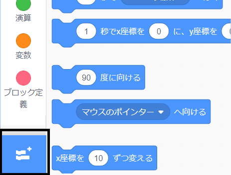
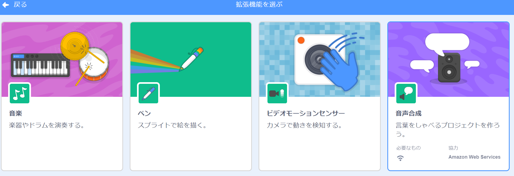
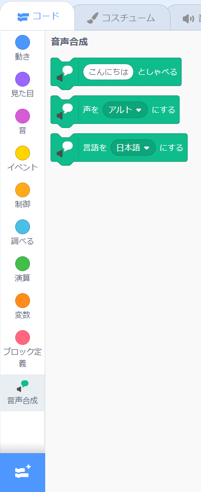

**ピコとギガはスピーチ拡張機能で話します**： [内部を参照](https://scratch.mit.edu/projects/566006599/editor){:target="_blank"}

<div class="scratch-preview">
  <iframe allowtransparency="true" width="485" height="402" src="https://scratch.mit.edu/projects/embed/566006599/?autostart=false" frameborder="0"></iframe>
</div>

**拡張機能を追加**：をクリックします。



**音声合成**を選択します。



新しい `音声合成`{:class="block3extensions"}ブロックメニューが表示されます。



`音声合成`{:class="block3extensions"}ブロックメニューのブロックを使用して、スプライトに話をさせることができます。

クリックすると、スプライトが声を出して話をします。

```blocks3
when this sprite clicked
set voice to (alto v) :: tts
set language to (Spanish v) :: tts
speak [こんにちは] :: tts
```

スプライトに子猫の声を出させることもできます！

```blocks3
set voice to (kitten v) :: tts
speak [猫はミルクをのまなきゃ。] :: tts
```
