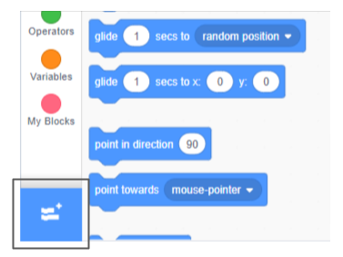
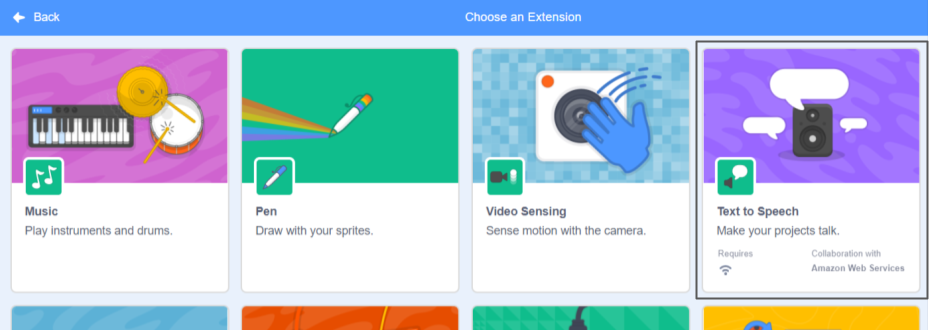

**Pico ಮತ್ತು Giga ಸ್ಪೀಚ್ ವಿಸ್ತರಣೆಯೊಂದಿಗೆ ಮಾತನಾಡುತ್ತಾರೆ**: [ಒಳಗೆ ನೋಡಿ](https://scratch.mit.edu/projects/499373708/editor){: target = "_ blank"}

<div class="scratch-preview">
  <iframe allowtransparency="true" width="485" height="402" src="https://scratch.mit.edu/projects/embed/499373708/?autostart=false" frameborder="0"></iframe>
</div>

**Add Extension** ಮೇಲೆ ಕ್ಲಿಕ್ ಮಾಡಿ:



**Text to Speech** ಅನ್ನ ಆರಿಸಿ:



ಹೊಸ `Text to Speech`{:class="block3extensions"} ಬ್ಲಾಕ್ಸ ಮೆನು ಬರುವುದು:


`Text to Speech`{:class="block3extensions"} ಬ್ಲಾಕ್ಸ ಮೆನುವಿನಲ್ಲಿರುವ ಬ್ಲಾಕ್ಸಗಳನ್ನು ಬಳಸಿ ಸ್ಪ್ರೈಟ್ ಅನ್ನು ಮಾತಾಡಿಸಬಹುದು.

ಕ್ಲಿಕ್ ಮಾಡಿದಾಗ ಸ್ಪ್ರೈಟ್ ಜೋರಾಗಿ ಮಾತನಾಡುವಂತೆ ಮಾಡಬಹುದು:

```blocks3
when this sprite clicked
set voice to (alto v) :: tts
set language to (Spanish v) :: tts
speak [Hola] :: tts
```

ನಿಮ್ಮ ಸ್ಪ್ರೈಟ್‌ಗೆ ಬೆಕ್ಕಿನ ಧ್ವನಿಯನ್ನು ಸಹ ನೀಡಬಹುದು!

```blocks3
set voice to (kitten v) :: tts
speak [Cat gotta haz milk.] :: tts
```
