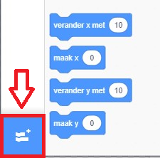
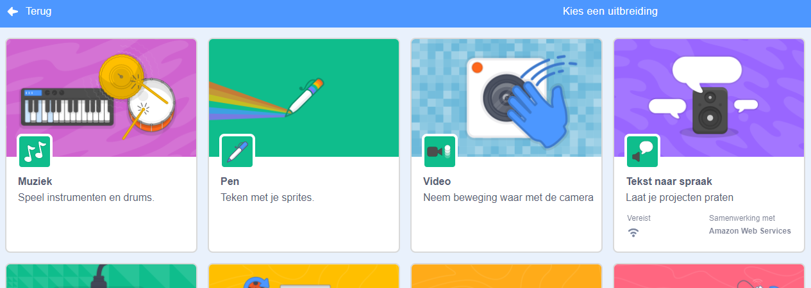
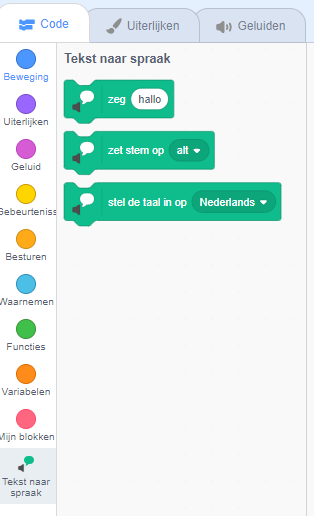

**Pico en Giga praten met de spraakuitbreiding**: [Bekijk van binnen](https://scratch.mit.edu/projects/499373708/editor){:target="_blank"}

<div class="scratch-preview">
  <iframe allowtransparency="true" width="485" height="402" src="https://scratch.mit.edu/projects/embed/499373708/?autostart=false" frameborder="0"></iframe>
</div>

Klik op **Voeg een uitbreiding toe**:



Kies **Tekst naar spraak**:



Je krijgt een nieuw `Tekst naar spraak`{:class="block3extensions"} blokken menu:



Je kunt de blokken in het `Tekst naar spraak`{:class="block3extensions"} blokken menu gebruiken om je sprites hardop te laten praten.

You can make a sprite talk out loud when clicked:

```blocks3
when this sprite clicked
set voice to (alto v) :: tts
set language to (Spanish v) :: tts
speak [Hola] :: tts
```

You can even give your sprite a kitten voice!

```blocks3
set voice to (kitten v) :: tts
speak [Cat gotta haz milk.] :: tts
```
