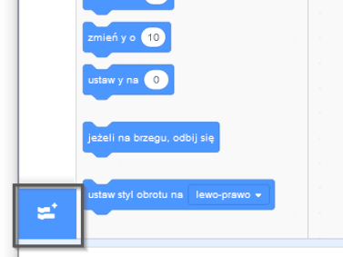
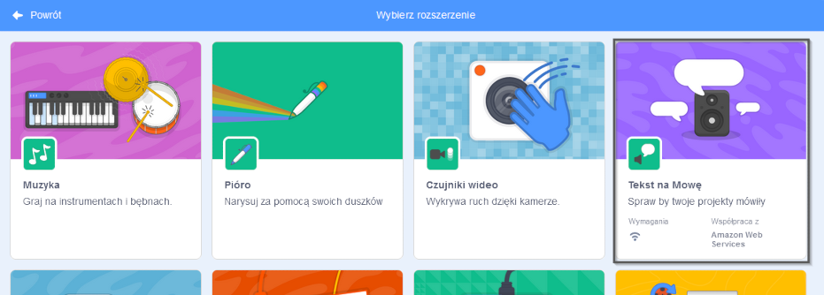
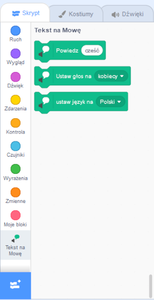

**Pico i Giga rozmawiają z rozszerzeniem mowy**: [Zajrzyj do środka](https://scratch.mit.edu/projects/499373708/editor){:target="_blank"}

<div class="scratch-preview">
  <iframe allowtransparency="true" width="485" height="402" src="https://scratch.mit.edu/projects/embed/499373708/?autostart=false" frameborder="0"></iframe>
</div>

Kliknij **Dodaj rozszerzenie**:



Wybierz **Tekst na Mowę**:



Dostaniesz nowe menu bloków `Tekst na Mowę`{class="block3extensions"}:



Możesz użyć bloków w menu bloków `Tekst na mowę`{:class="block3extensions"}, aby Twoje duszki mówiły na głos.

Możesz sprawić, by duszek zaczął mówić po kliknięciu:

```blocks3
when this sprite clicked
set voice to (alto v) :: tts
set language to (Spanish v) :: tts
speak [Hola] :: tts
```

Możesz nawet nadać swojemu duszkowi głos kotka!

```blocks3
ustaw głos na (kitten v) :: tts
mów [Kot chce mleko.] :: tts
```
