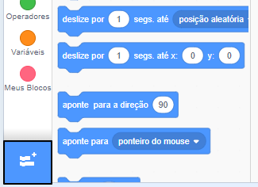
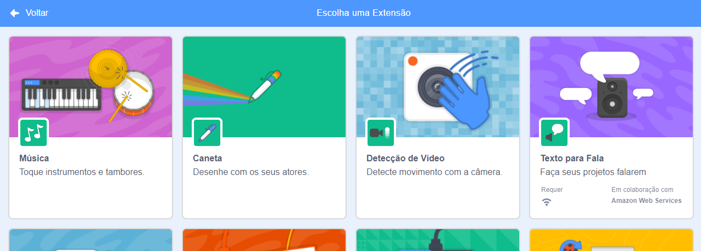
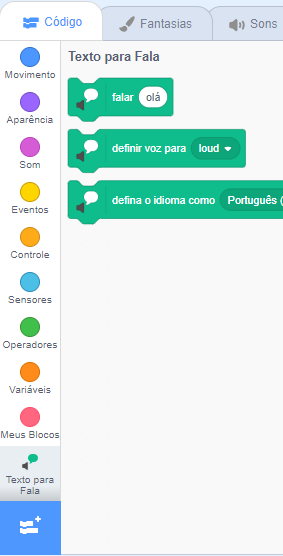

**Pico e Giga falam com a extensão Fala**: [Ver interior](https://scratch.mit.edu/projects/572518523/editor){:target="_blank"}

<div class="scratch-preview">
  <iframe allowtransparency="true" width="485" height="402" src="https://scratch.mit.edu/projects/embed/572518523/?autostart=false" frameborder="0"></iframe>
</div>

Clique em **Adicionar Extensão**:



Escolha **Texto para Fala**:



Você obterá um novo menu de blocos `Texto para Fala`{:class="block3extensions"}:



Você pode usar os blocos dentro do blocos de menu `Texto para Fala`{:class="block3extensions"} para fazer os seus atores falarem em voz alta.

Você pode fazer um ator falar em voz alta quando clicado:

```blocks3
when this sprite clicked
set voice to (alto v) :: tts
set language to (Portuguese Brazilian v) :: tts
speak [Olá] :: tts
```

Você pode até mesmo fazer o seu ator falar com uma voz de gatinho!

```blocks3
set voice to (kitten v) :: tts
speak [O gato tem leite haz.] :: tts
```
