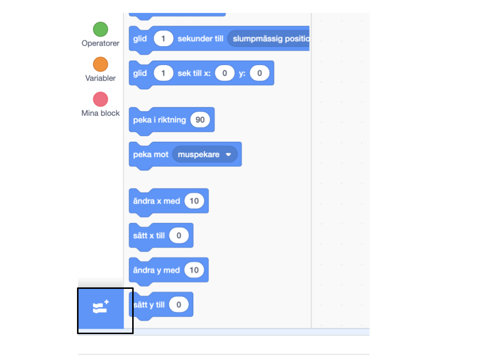
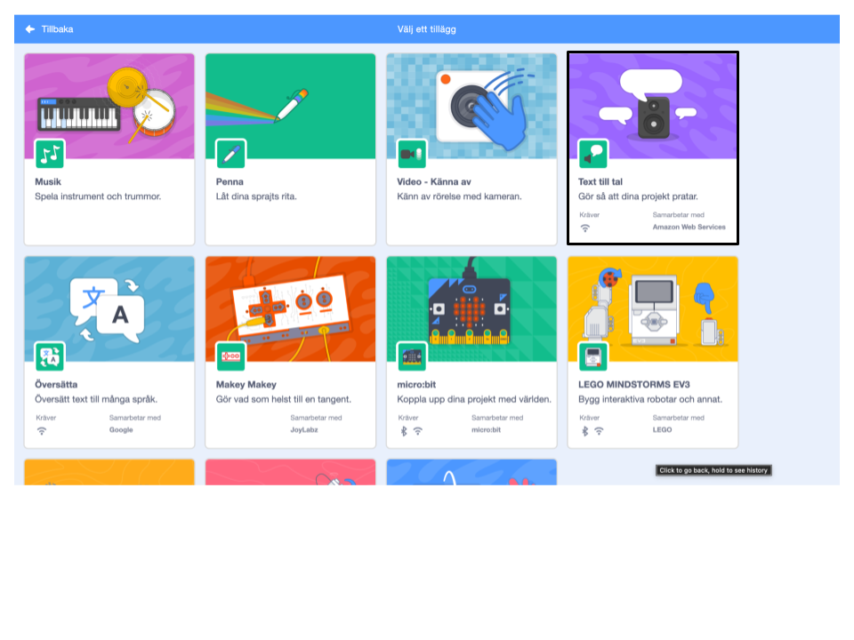
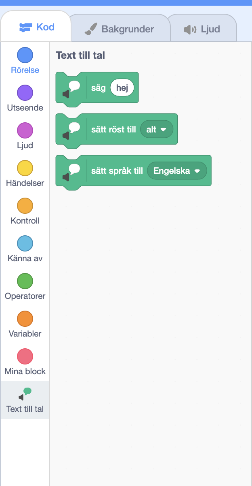

**Pico och Giga pratar med taltilläget**: [Se inuti](https://scratch.mit.edu/projects/499373708/editor){:target="_blank"}

<div class="scratch-preview">
  <iframe allowtransparency="true" width="485" height="402" src="https://scratch.mit.edu/projects/embed/499373708/?autostart=false" frameborder="0"></iframe>
</div>

Klicka på **Lägg till tillägg**:



Välj **text till tal**:



Du kommer att få en ny `"Text till tal"`{:class="block3extensions"}-blockmeny:



Du kan använda blocken i `"Text till tal"`{:class="block3extensions"}-blockmenyn för att få dina sprajter att prata högt.

Du kan få en sprajt att prata när du klickar på den:

```blocks3
when this sprite clicked
set voice to (alto v) :: tts
set language to (Spanish v) :: tts
speak [Hola] :: tts
```

Du kan till och med ge din sprajt en kattunges röst!

```blocks3
set voice to (kitten v) :: tts
speak [Cat gotta haz milk.] :: tts
```
