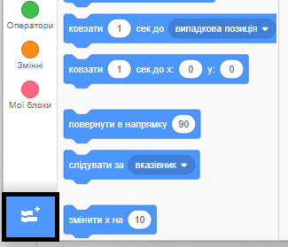
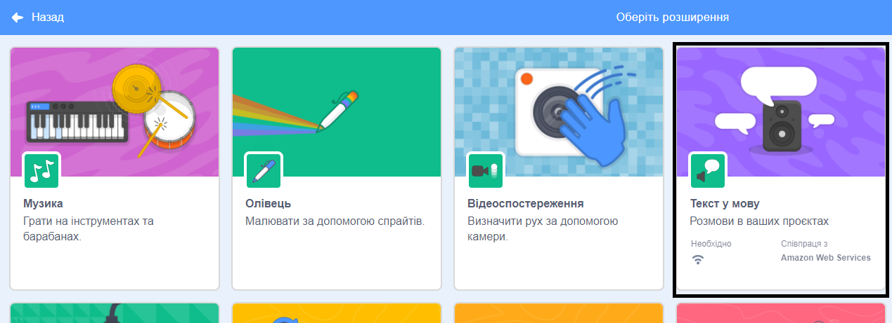
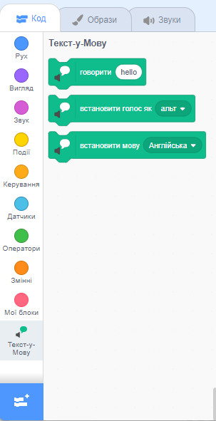

**Pico та Giga розмовляють завдяки розширенню мови**: [Переглянути код](https://scratch.mit.edu/projects/499373708/editor){:target="_blank"}

<div class="scratch-preview">
  <iframe allowtransparency="true" width="485" height="402" src="https://scratch.mit.edu/projects/embed/499373708/?autostart=false" frameborder="0"></iframe>
</div>

Клацни на **Додати Розширення**:



Вибери **Додати Розширення**:



З'являться нові меню блоків `Текст у мову`{:class="block3extensions"}:



Ти можеш використовувати блоки з меню блоків `Текст у мову`{:class="block3extensions"}, щоб змусити спрайти заговорити.

Ти можеш зробити так, щоб спрайт говорив вголос коли на нього натискаєш:

```blocks3
when this sprite clicked
set voice to (alto v) :: tts
set language to (Spanish v) :: tts
speak [Hola] :: tts
```

Ти навіть можеш наділити свій спрайт голосом котика!

```blocks3
set voice to (kitten v) :: tts
speak [Кіт повинен пити молоко.] :: tts
```