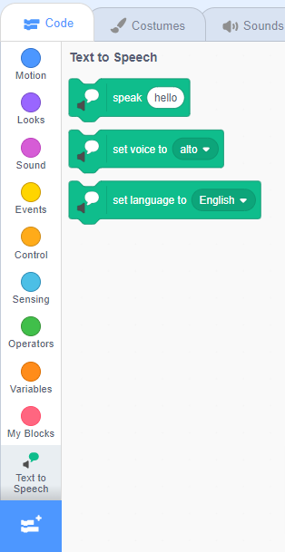

**پیکو اور گیگا اسپیچ ایکسٹینشن کے ساتھ بات کرتے ہیں**: [اندر دیکھیں](https://scratch.mit.edu/projects/499373708/editor){:target="_blank"}

<div class="scratch-preview">
  <iframe allowtransparency="true" width="485" height="402" src="https://scratch.mit.edu/projects/embed/499373708/?autostart=false" frameborder="0"></iframe>
</div>

**شامل کریں ایکسٹینشن**پر کلک کریں:


**شامل کریں ایکسٹینشن**پر کلک کریں:


آپ کو ایک نیا `ٹیکسٹ ٹو اسپیچ`{:class="block3extensions"} بلاکس مینو ملے گا:



آپ `ٹیکسٹ ٹو اسپیچ`{:class="block3extensions"} بلاکس مینو میں بلاکس کو استعمال کر سکتے ہیں تاکہ آپ کے اسپرائٹس اونچی آواز میں بات کر سکیں۔

کلک کرنے پر آپ اونچی آواز میں اسپرائٹ ٹاک کر سکتے ہیں:

```blocks3
when this sprite clicked
set voice to (alto v) :: tts
set language to (Spanish v) :: tts
speak [Hola] :: tts
```

کلک کرنے پر آپ اونچی آواز میں اسپرائٹ ٹاک کر سکتے ہیں:

```blocks3
set voice to (kitten v) :: tts
speak [Cat gotta haz milk.] :: tts
```
