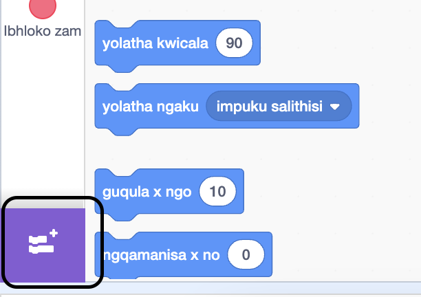
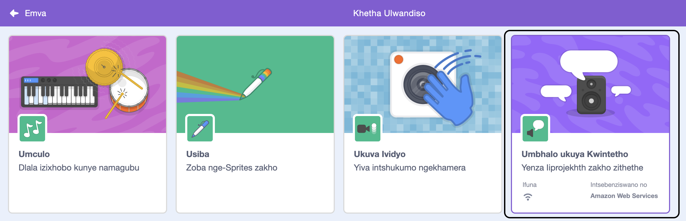
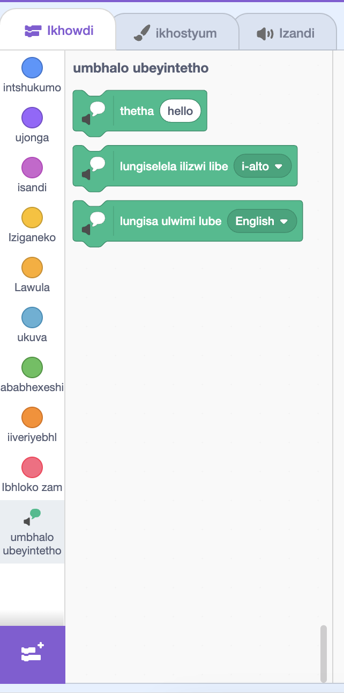

**Pico kunye ne-Giga bathetha kunye nolwandiso lwentetho**: [Bona ngaphakathi kwe](https://scratch.mit.edu/projects/499373708/editor){:target="_blank"}

<div class="scratch-preview">
  <iframe allowtransparency="true" width="485" height="402" src="https://scratch.mit.edu/projects/embed/499373708/?autostart=false" frameborder="0"></iframe>
</div>

Cofa ku- **Yongeza Ulwandiso**:



Khetha isiqendu esingu **kwiNtetho yoku-**:



Uya kufumana umbhalo omtsha ongu `kwiNtetho`{:class="block3extensions"} iibhloko zemenyu:



Ungasebenzisa iibhloko kwi `Okubhaliweyo kwiNtetho`{:class="block3extensions"} iibhloko zemenyu ukwenza i-sprites yakho ithethe ngokuvakalayo.

Unokwenza isprite sithethe ngokuvakalayo xa ucofa:

```blocks3
when this sprite clicked
set voice to (alto v) :: tts
set language to (Spanish v) :: tts
speak [Hola] :: tts
```

Unganika i-sprite yakho ilizwi lekati!

```blocks3
set voice to (kitten v) :: tts
speak [Cat gotta haz milk.] :: tts
```
